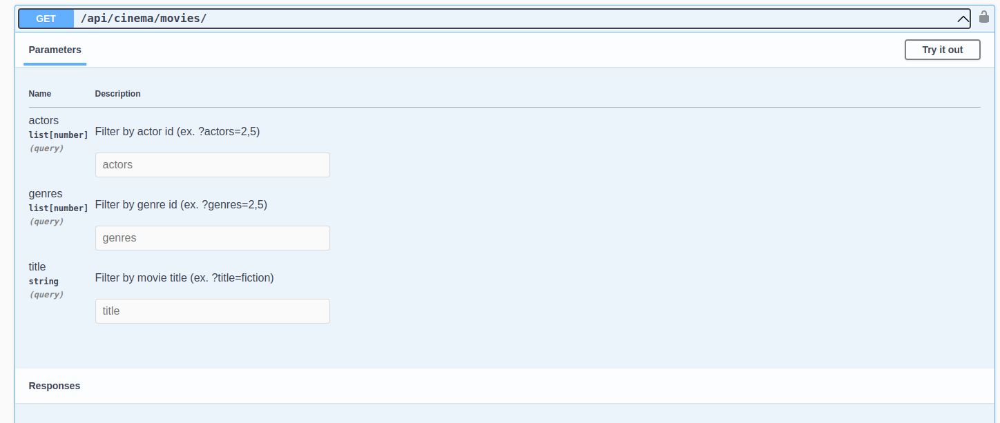
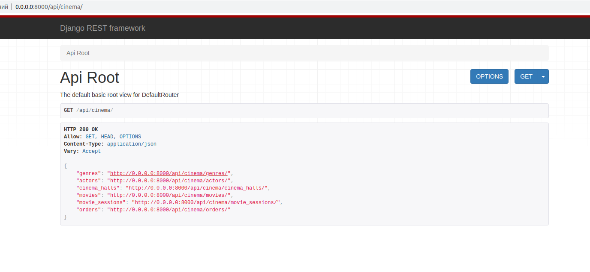
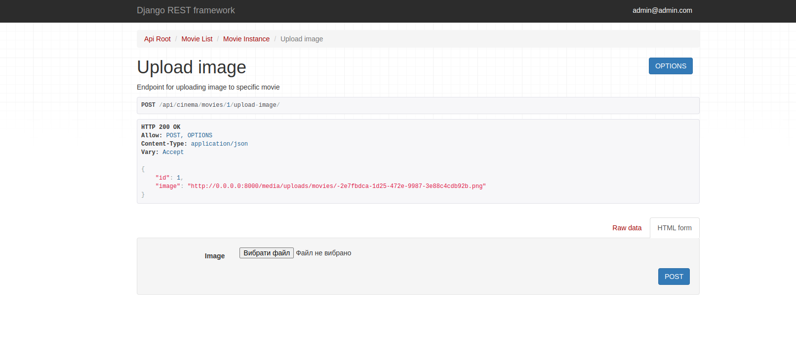

## Cinema-API DRF

Project API service for managing order and tickets and movies based Django Rest Framework.

## Features
- JWT authentication
- Admin panel /admin/
- Documentation is located at /api/doc/swagger/
- Managing orders and tickets on movie session
- Creating user at /api/user/register/
- Login user at /api/user/token/
- Upload image to movie at api/cinema/movie/id/upload-image
- Creating cinema halls
- Adding movie sessions
- Filtering movies and movie sessions





## Installing using GitHub
```bash
git clone git@github.com:yevhenii-nevmyvako/Cinema-API-DRF.git
cd Cinema-API
python -m venv venv
sourve venv/bin/activate
pip install -r requirements.txt
````

### Run on local server
- Install PostgreSQL, create DB and User
- Connect DB
- Run:
```bash
python manage.py makemigrations
python manage.py migrate
python manage.py runserver
```

### Run with Docker
Docker should be already installed
```bash
docker-compose up -d --build
docker-compose down
docker-compose -f docker-compose.yml up -d --build
docker-compose up
```

### Create/Authenticate User
```bash
- Path to create user api/user/register
- Path to login user api/user/token
```

### Stop server:
```bash
dokcer-compose down
```


